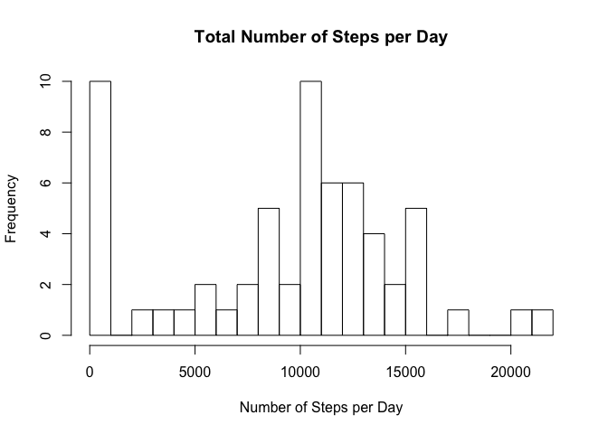
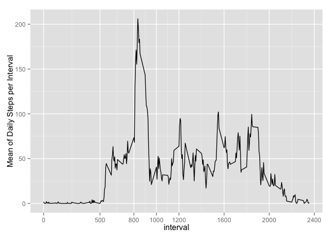
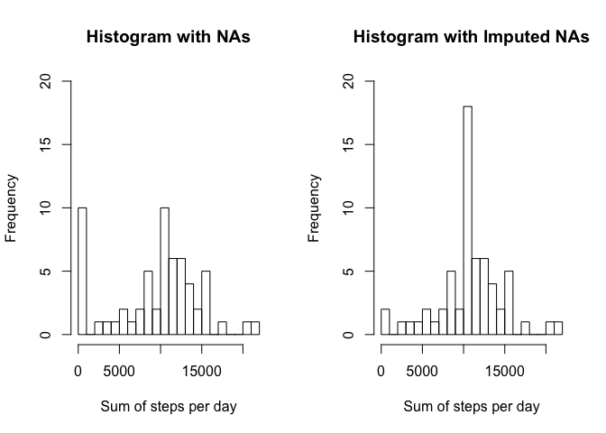

# Reproducible Research: Peer Assessment 1


## Loading and preprocessing the data

```r
# Download the file if necessary and load it
if (!file.exists("activity.csv")) {
    fileUrl <-"https://d396qusza40orc.cloudfront.net/repdata%2Fdata%2Factivity.zip"
    download.file(fileUrl, destfile = "activity.zip", method = "curl")
    unzip("activity.zip")
}
activity <- read.csv("activity.csv")
str(activity)
```

```
## 'data.frame':	17568 obs. of  3 variables:
##  $ steps   : int  NA NA NA NA NA NA NA NA NA NA ...
##  $ date    : Factor w/ 61 levels "2012-10-01","2012-10-02",..: 1 1 1 1 1 1 1 1 1 1 ...
##  $ interval: int  0 5 10 15 20 25 30 35 40 45 ...
```

## What is mean total number of steps taken per day?

```r
activity$date <- as.Date(activity$date)
steps_sum_per_day <- tapply(activity$steps,activity$date,sum, na.rm=T)
steps_sum_per_day
```

```
## 2012-10-01 2012-10-02 2012-10-03 2012-10-04 2012-10-05 2012-10-06 
##          0        126      11352      12116      13294      15420 
## 2012-10-07 2012-10-08 2012-10-09 2012-10-10 2012-10-11 2012-10-12 
##      11015          0      12811       9900      10304      17382 
## 2012-10-13 2012-10-14 2012-10-15 2012-10-16 2012-10-17 2012-10-18 
##      12426      15098      10139      15084      13452      10056 
## 2012-10-19 2012-10-20 2012-10-21 2012-10-22 2012-10-23 2012-10-24 
##      11829      10395       8821      13460       8918       8355 
## 2012-10-25 2012-10-26 2012-10-27 2012-10-28 2012-10-29 2012-10-30 
##       2492       6778      10119      11458       5018       9819 
## 2012-10-31 2012-11-01 2012-11-02 2012-11-03 2012-11-04 2012-11-05 
##      15414          0      10600      10571          0      10439 
## 2012-11-06 2012-11-07 2012-11-08 2012-11-09 2012-11-10 2012-11-11 
##       8334      12883       3219          0          0      12608 
## 2012-11-12 2012-11-13 2012-11-14 2012-11-15 2012-11-16 2012-11-17 
##      10765       7336          0         41       5441      14339 
## 2012-11-18 2012-11-19 2012-11-20 2012-11-21 2012-11-22 2012-11-23 
##      15110       8841       4472      12787      20427      21194 
## 2012-11-24 2012-11-25 2012-11-26 2012-11-27 2012-11-28 2012-11-29 
##      14478      11834      11162      13646      10183       7047 
## 2012-11-30 
##          0
```

```r
hist(steps_sum_per_day,breaks=20,main="Total Number of Steps per Day",xlab="Number of Steps per Day")
```

 

```r
# Display mean and median number of steps per day
mean_total_steps_per_day <- mean(steps_sum_per_day)
mean_total_steps_per_day
```

```
## [1] 9354.23
```

```r
median_total_steps_per_day <- median(steps_sum_per_day)
median_total_steps_per_day
```

```
## [1] 10395
```

## What is the average daily activity pattern?

```r
require(ggplot2)
```

```
## Loading required package: ggplot2
```

```r
steps_mean_per_interval <- as.numeric(tapply(activity$steps,activity$interval,mean, na.rm=T))

interval <- unique(activity$interval)
interval_mean_df<-data.frame(interval,steps_mean_per_interval)
ggplot(interval_mean_df,aes(x=interval,y=steps_mean_per_interval)) +     geom_line()+scale_x_continuous(name="interval",breaks=c(0,500,800,1000,1200,1600,2000,2400)) + ylab("Mean of Daily Steps per Interval")
```

 

```r
max_mean <- max(steps_mean_per_interval)
max_interval <- interval[which(steps_mean_per_interval==max(steps_mean_per_interval))]
```
NOTE: The maximum number of steps **206.1698113** occurs at **835** interval.

## Imputing missing values

```r
# Number of missing values
na_count <- sum(is.na(activity$steps))
na_count
```

```
## [1] 2304
```

```r
# Create a new data set with missing values filled in with the mean for the 5-minute interval
new_activity <- activity
# create a vector of indices with missing steps values
na_idx <- which(is.na(new_activity$steps))
# create a vector of matches interval_mean_df as the lookup table
na_matches <- match(new_activity[na_idx,"interval"],interval_mean_df$interval)
# fill in the missing values with the mean
new_activity$steps[na_idx] <- interval_mean_df[na_matches,"steps_mean_per_interval"]
# Number of missing values in new_activity
new_na_count <- sum(is.na(new_activity$steps))
new_na_count
```

```
## [1] 0
```

```r
# calculate sum, mean and median for the new_activity
new_steps_sum_per_day <- tapply(new_activity$steps,new_activity$date,sum, na.rm=T)

# Plot the histograms comparing the two
require(xtable)
```

```
## Loading required package: xtable
```

```r
par(mfrow=c(1,2))
hist(steps_sum_per_day,breaks=20,ylim=c(0,20),xlab="Sum of steps per day",main="Histogram with NAs")
hist(new_steps_sum_per_day,breaks=20,ylim=c(0,20),xlab="Sum of steps per day",main="Histogram with Imputed NAs")
```

 

```r
# Display mean and median number of steps per day with imputed NAs
new_mean_total_steps_per_day <- mean(new_steps_sum_per_day)
new_mean_total_steps_per_day
```

```
## [1] 10766.19
```

```r
new_median_total_steps_per_day <- median(new_steps_sum_per_day)
new_median_total_steps_per_day
```

```
## [1] 10766.19
```

*Filling the NAs with the mean for each interval aligned the mean and the median of the total steps per day.*

## Are there differences in activity patterns between weekdays and weekends?

```r
require(lattice)
```

```
## Loading required package: lattice
```

```r
type_of_day<-ifelse(weekdays(new_activity$date) %in% c("Saturday","Sunday"),"weekend","weekday")

new_activity <- cbind(new_activity,type_of_day)
weekday_subset <- subset(new_activity,type_of_day=="weekday")
weekday_mean <- as.numeric(tapply(weekday_subset$steps,weekday_subset$interval,mean, na.rm=T))
weekend_subset <- subset(new_activity,type_of_day=="weekend")
weekend_mean <- as.numeric(tapply(weekend_subset$steps,weekend_subset$interval,mean, na.rm=T))

weekday_df <- data.frame(mean=weekday_mean,day=c("weekday"),interval)
weekend_df <- data.frame(mean=weekend_mean,day=c("weekend"),interval)
all_days <- rbind(weekday_df,weekend_df)

xyplot(mean ~ interval | day,data=all_days,type="l",layout=c(1,2),xlab="Interval",ylab="Number of steps")
```

 

```r
# weekday versus weekend
weekday_max_mean <- max(weekday_df$mean)
weekday_max_interval <- weekday_df$interval[which(weekday_df$mean==weekday_max_mean)]
weekend_max_mean <- max(weekend_df$mean)
weekend_max_interval <- weekend_df$interval[which(weekend_df$mean==weekend_max_mean)]
```
The weekday maximum number of steps **230.3781971** occurs at **835** interval while weekend is **166.6391509** at **915** interval.
